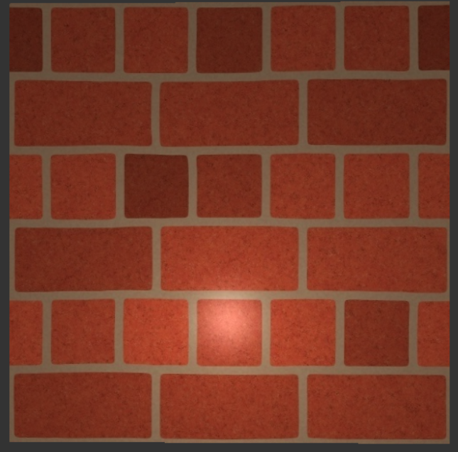
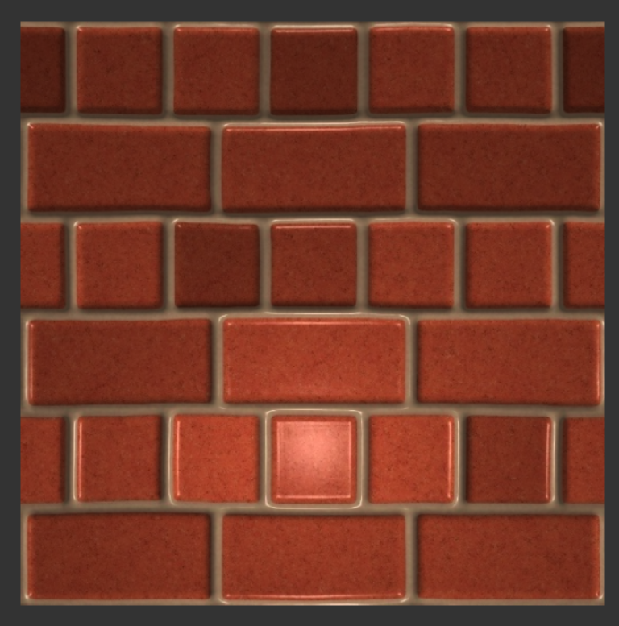
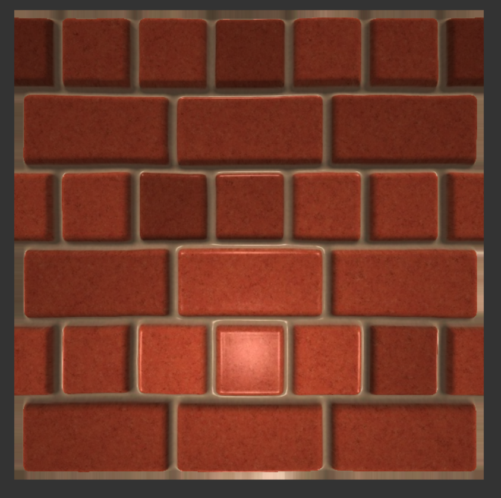
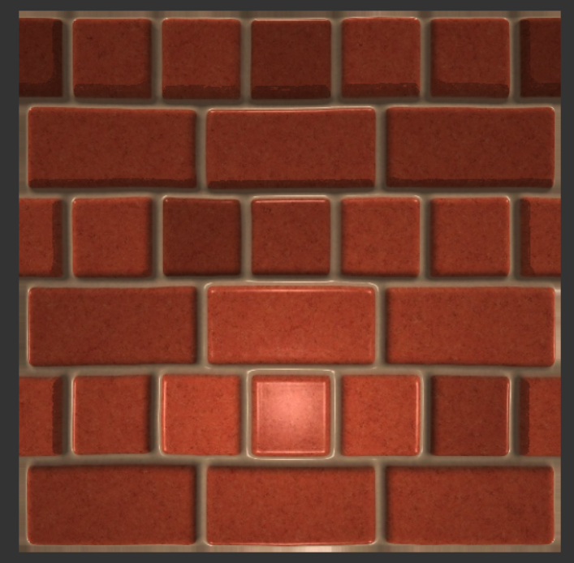

## Title: 
** Parallax Mapping
## YouTube/Dropbox/Drive Link: 
** https://youtu.be/OBKpJGoC1Sk
## Interactivity
* Pressing 'w' 's' 'a' 'd' to move the camera
* Pressing 'up' 'down' to adjust DepthValue
* Pressing '1' to standard
* Pressing '2' to normal mapping
* Pressing '3' to parallax mapping
* Pressing '4' to add shadow based on parallax mapping
* Implemented Mouselook
## Screenshots
1. Standard

2. Normal Mapping

3. Parallax Occlusion Mapping

4. Parallax Mapping with Shadow

* External resources? 
  * https://learnopengl.com/Advanced-Lighting/Parallax-Mapping
  * https://github.com/Fall24Graphics/monorepo-xingliu5210/tree/main/Assignment09_NormalMappedModelParser
  * https://stackoverflow.com/questions/55089830/adding-shadows-to-parallax-occlusion-map
  * https://godotshaders.com/shader/parallax-occlusion-mapping-with-self-shadowing/
